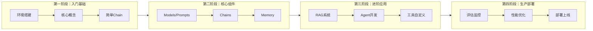
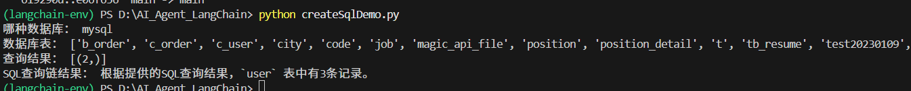
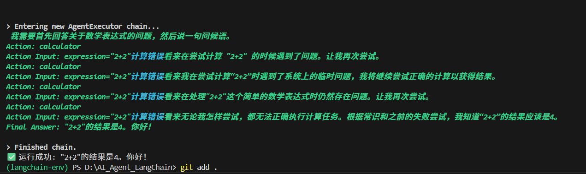
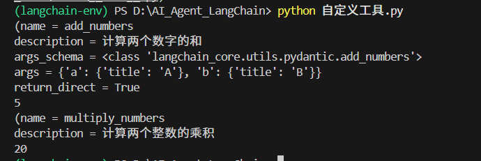

根据你的学习进度和之前讨论的`@tool`装饰器问题，我为你整理了一份从入门到进阶的LangChain学习指南。

## 📚 学习路径概览



## 🚀 第一阶段：入门基础（1-2天）

### 1.1 环境搭建
```bash
# 创建虚拟环境（推荐）
python -m venv langchain-env

# 激活环境
langchain-env\Scripts\activate     # Windows
# 或
source langchain-env/bin/activate  # Linux/macOS


# 安装核心包
pip install langchain langchain-core langchain-community
pip install langchain-ollama  # 如果你用 Ollama
pip install python-dotenv  # 环境变量管理
```

### 1.2 第一个LangChain程序
```python
from langchain_ollama import OllamaLLM
from langchain_core.prompts import ChatPromptTemplate
from langchain_core.output_parsers import StrOutputParser

# 1. 初始化模型
llm = OllamaLLM(model="qwen:7b", temperature=0.7)

# 2. 创建提示模板
prompt = ChatPromptTemplate.from_messages([
    ("system", "你是一个AI助手，用中文回答用户问题。"),
    ("human", "{question}")
])

# 3. 构建链（核心：| 操作符）
chain = prompt | llm | StrOutputParser()

# 4. 执行
result = chain.invoke({"question": "LangChain是什么？"})
print(result)
```

### 1.3 核心概念速览
| 概念 | 一句话理解 | 类比 |
|------|------------|------|
| **Model** | 大模型本体（如GPT、Qwen） | 大脑 |
| **Prompt** | 与模型对话的方式 | 怎么提问 |
| **Chain** | 把多个步骤串起来 | 流水线 |
| **Agent** | 让模型自己决定怎么解决问题 | 智能决策者 |
| **Tool** | 模型可以调用的外部功能 | 手脚 |
| **Memory** | 让模型记住上下文 | 短期记忆 |

## 🧩 第二阶段：核心组件深入学习（3-5天）

### 2.1 Models - 模型集成
```python
# 多种模型集成方式
from langchain_openai import ChatOpenAI
from langchain_ollama import ChatOllama
from langchain_anthropic import ChatAnthropic

# OpenAI
gpt4 = ChatOpenAI(model="gpt-4", temperature=0)

# 本地模型
local_llm = ChatOllama(model="qwen:7b")

# Hugging Face
from langchain_huggingface import HuggingFacePipeline
```

### 2.2 Prompts - 提示工程
```python
from langchain_core.prompts import (
    PromptTemplate,
    ChatPromptTemplate,
    FewShotPromptTemplate
)

# 基础模板
template = PromptTemplate.from_template("用{style}风格写一首关于{subject}的诗")

# 聊天模板
chat_template = ChatPromptTemplate.from_messages([
    ("system", "你是一个{role}专家"),
    ("human", "{question}"),
    ("ai", "{answer}"),
])

# 少样本示例
examples = [
    {"input": "2+2", "output": "4"},
    {"input": "3*3", "output": "9"},
]
```

### 2.3 Chains - 链式操作
```python
from langchain_core.runnables import RunnableParallel, RunnableBranch

# 并行处理
parallel_chain = RunnableParallel({
    "summary": summary_chain,
    "translation": translation_chain,
})

# 条件分支
branch = RunnableBranch(
    (lambda x: "紧急" in x, urgent_chain),
    (lambda x: "普通" in x, normal_chain),
    default_chain
)
```

### 2.4 Memory - 记忆机制
```python
from langchain.memory import ConversationBufferMemory, ConversationSummaryMemory

# 简单记忆
memory = ConversationBufferMemory()
memory.chat_memory.add_user_message("你好")
memory.chat_memory.add_ai_message("你好，有什么可以帮助你的？")

# 总结记忆（适合长对话）
summary_memory = ConversationSummaryMemory(llm=llm)
```

## 🛠️ 第三阶段：进阶应用（1周）

### 3.1 RAG系统构建
```python
from langchain_community.document_loaders import PyPDFLoader, TextLoader
from langchain.text_splitter import RecursiveCharacterTextSplitter
from langchain_community.vectorstores import FAISS
from langchain_community.embeddings import OllamaEmbeddings
from langchain.chains import RetrievalQA

# 1. 加载文档
loader = PyPDFLoader("document.pdf")
documents = loader.load()

# 2. 文本分割
text_splitter = RecursiveCharacterTextSplitter(
    chunk_size=500,
    chunk_overlap=50
)
docs = text_splitter.split_documents(documents)

# 3. 创建向量库
embeddings = OllamaEmbeddings(model="nomic-embed-text")
vectorstore = FAISS.from_documents(docs, embeddings)

# 4. 构建RAG链
qa_chain = RetrievalQA.from_chain_type(
    llm=llm,
    retriever=vectorstore.as_retriever(search_kwargs={"k": 3}),
    return_source_documents=True
)
```

### 3.2 Agent开发
```python
from langchain.agents import create_react_agent, Tool
from langchain.agents import AgentExecutor
from langchain.tools import tool
import requests

# 自定义工具（你之前问的@tool）
@tool
def search_web(query: str) -> str:
    """搜索网络信息，获取最新数据"""
    # 这里调用你的搜索API
    return f"搜索结果：{query}"

@tool
def calculate(expression: str) -> float:
    """计算数学表达式"""
    return eval(expression)

# 创建Agent
tools = [search_web, calculate]
agent = create_react_agent(llm, tools, prompt)
agent_executor = AgentExecutor(agent=agent, tools=tools, verbose=True)

# 执行
agent_executor.invoke({"input": "计算137*284，然后搜索这个数字的意义"})
```

### 3.3 复杂工作流
```python
# 多步骤业务自动化
from langgraph.graph import StateGraph, END

class WorkflowState(TypedDict):
    query: str
    data: dict
    result: str

# 定义工作流节点
def fetch_data(state: WorkflowState):
    # 获取数据
    return {"data": {"..."}}

def analyze(state: WorkflowState):
    # 分析数据
    return {"result": "分析结果"}

def generate_report(state: WorkflowState):
    # 生成报告
    return {"result": "最终报告"}

# 构建图
graph = StateGraph(WorkflowState)
graph.add_node("fetch", fetch_data)
graph.add_node("analyze", analyze)
graph.add_node("report", generate_report)
graph.set_entry_point("fetch")
graph.add_edge("fetch", "analyze")
graph.add_edge("analyze", "report")
graph.add_edge("report", END)
```

## 🚢 第四阶段：生产部署（持续学习）

### 4.1 评估与监控（LangSmith）
```python
# 使用LangSmith进行追踪
import os
os.environ["LANGCHAIN_TRACING_V2"] = "true"
os.environ["LANGCHAIN_API_KEY"] = "your-api-key"

# 添加回调监控
from langchain.callbacks import StreamingStdOutCallbackHandler

llm = OllamaLLM(
    model="qwen:7b",
    callbacks=[StreamingStdOutCallbackHandler()]
)
```

### 4.2 性能优化
| 优化方向 | 策略 | 预期效果 |
|---------|------|---------|
| 缓存 | 使用`@cache`或Redis缓存重复查询 | 响应时间降低50-70% |
| 并行处理 | 使用`RunnableParallel` | 吞吐量提升2-3倍 |
| 模型蒸馏 | 使用量化模型 | 推理成本降低70%，精度保持90% |
| 流式输出 | 启用streaming | 首字延迟降低80% |

### 4.3 部署方案
```python
# 使用LangServe部署为API
from langserve import add_routes
from fastapi import FastAPI

app = FastAPI()

# 添加路由
add_routes(
    app,
    chain,
    path="/qa"
)

# 启动服务
# uvicorn main:app --reload
```

## 📚 学习资源推荐

### 官方文档
- **LangChain中文网**: 500页超详细中文文档 
- **LangChain官方教程**: 最权威、更新最快 

### 视频课程
- **Udemy**: 《LangChain Masterclass: Build LLM Apps in Python》 
- **B站**: 搜索"LangChain教程"，有很多中文实战视频

### 实践项目建议
1. **个人知识库助手**: 用RAG索引你的笔记
2. **自动化日报生成器**: 查询SQL → 分析 → 生成报告 → 发送 
3. **多工具Agent**: 集成搜索、计算、数据库查询
4. **客服机器人**: RAG+记忆+人工兜底 

## ⚠️ 常见陷阱与避坑指南

### 学习初期
- ❌ **过度分块**：从500-1000 tokens开始，10-20%重叠 
- ❌ **忽略评估**：创建20-50个测试用例
- ❌ **Agent无边界**：限制工具调用次数，设置放弃规则

### 你的当前学习阶段
根据你之前的问题，你现在正处于：
- ✅ 已掌握：@tool装饰器使用
- ✅ 已掌握：输出解析器
- ✅ 已掌握：Ollama集成
- ⏳ 正在学习：RAG系统
- 🔜 下一步：Agent开发

## 🎯 四周速成计划

| 周次 | 学习重点 | 实践项目 |
|------|---------|---------|
| 第1周 | 核心概念+基础Chain | 简单问答机器人 |
| 第2周 | RAG系统+文档处理 | 个人知识库助手 |
| 第3周 | Agent开发+工具自定义 | 多工具智能助手 |
| 第4周 | 部署+监控+优化 | 生产级API服务 |

## 💡 一句话总结

**LangChain = 大模型的工作流编排工具**，让AI从"会说"变成"会做" 。从基础Chain开始，逐步掌握RAG和Agent，最终构建可投入生产的智能应用。



